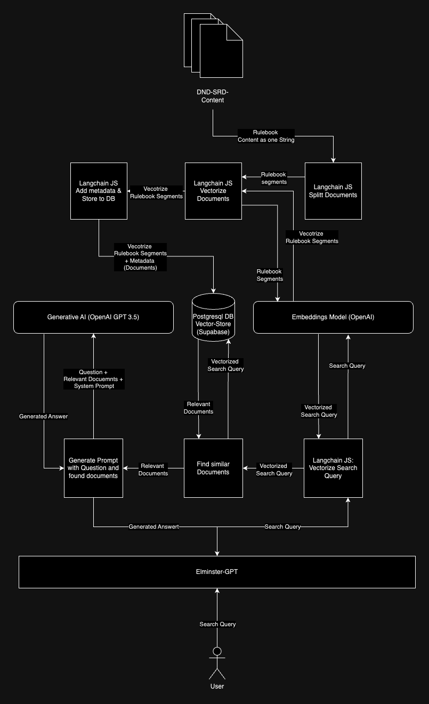

# Elminster-GPT: Open Source Dungeons & Dragons AI Chatbot

Elminster-GPT is an open-source AI chatbot developed using the Retrieval-Augmented Generation (RAG) architecture, tailored specifically for the Dungeons & Dragons universe through the usage of the content from the System Reference Document (SRD). This chatbot is designed to assist new players in familiarizing themselves with the intricate game mechanics of Dungeons & Dragons 5th Edition (5e).

**Getting Started**: To interact with Elminster-GPT, visit https://elminster-gpt.vercel.app/ and pose your questions. The chatbot leverages D&D SRD content to provide accurate responses, displaying the source paragraph from the SRD on the right side of the screen for reference.

## RAG Architecture

## References

* The foundation for this project is the [nextjs ai chatbot template](https://vercel.com/templates/next.js/nextjs-ai-chatbot), enabling rapid development and deployment.
* D&D SRD content utilized in this project is sourced from [BTMorton](https://github.com/BTMorton/dnd-5e-srd/tree/master/yaml), offering a comprehensive collection of D&D resources.

## Learning and Contributing

Are you keen on exploring RAG, Next.js, and Large Language Models (LLMs)? Join our community! Contributing to Elminster-GPT provided me with invaluable insights into these cutting-edge technologies. Whether you're looking to learn or contribute, your involvement is welcome. Dive into the world of AI-driven Dungeons & Dragons and enhance your understanding while contributing to an exciting project.