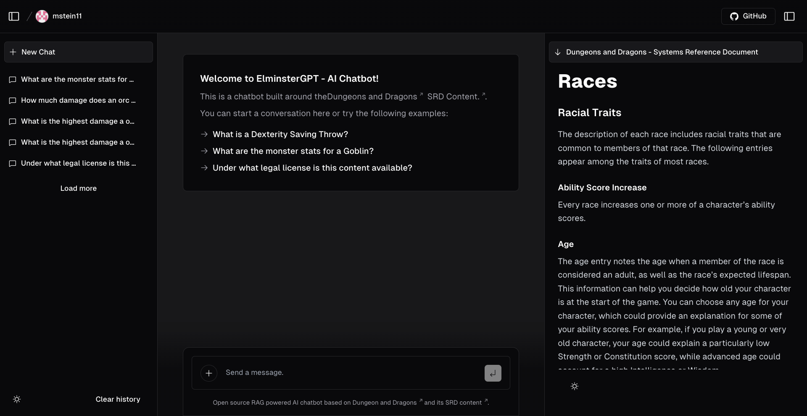
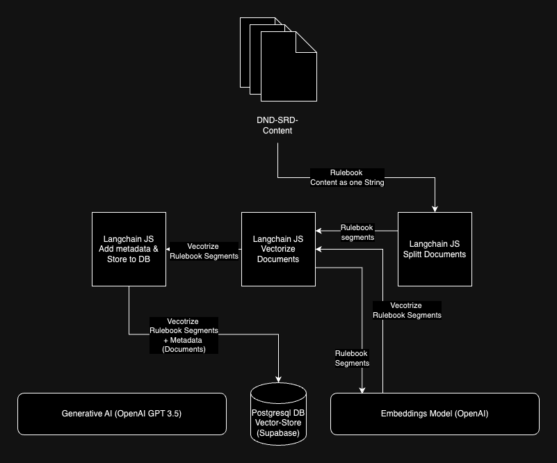
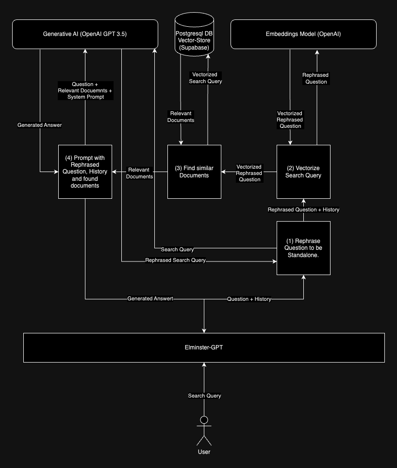

# Elminster-GPT: Open Source Dungeons & Dragons AI Chatbot

Elminster-GPT is an open-source AI chatbot developed using the Retrieval-Augmented Generation (RAG) architecture, tailored specifically for the Dungeons & Dragons universe through the usage of the content from the System Reference Document (SRD). This chatbot is designed to assist new players in familiarizing themselves with the intricate game mechanics of Dungeons & Dragons 5th Edition (5e).

**Getting Started**: To interact with Elminster-GPT, visit https://elminster-gpt.vercel.app/ and pose your questions. The chatbot leverages D&D SRD content to provide accurate responses, displaying the source paragraph from the SRD on the right side of the screen for reference.

## RAG Architecture

### Embedding step
An RAG approach is generally two stepped. First, the relevant Documents need to be vectorized, to make them available for the later retrieval step. This can be seen in the following diagram. 

As the diagram details, preparing input documents for retrieval augmented generation is done by:
1. splitting the Input into relevant chunks of a given size, 
2. generating the vectors through an embeddings model, and then 
3. saving those vectors to a vector store.

### Retrieval Step

The retrieval step allows us to embed context into an interaction with a LLM based Chatbot. The goal is to improve the Chatbots understanding of the domain on which the questions are based. In our example, we can ensure that the bot answers questions only based on the Dungeons and Dragons Rules. The retrieval step is detailed in the following example. 

1. Rephrase Question to be standalone:  This step is especially important if the user asks follow-up Questions. For details see Learning #1.
2. Vectorize Search Query: The rephrased question gets translated into a vector representation by the embeddings model.
3. Find Similar Documents: The vectorized rephrased Question is used to query the vector store with our input documents. A vector similarity search is done, and the closest 5 vectors and their textual representation are returned. These Documents are passed on to the next step as context.
4. The LLM (ChatGPT 3.5) takes the rephrased Question, the relevant Context and the Chat history and generates an answer based on this information.  

## Learnings

### Learning #1:
The embedding model's handling of conversational history presented a challenge. For example, the bot initially struggled with contextualizing follow-up questions, such as deducing that inquiries about spells were related to a previously mentioned wizard class.
The Solution: Integrating a feature where the AI restructures queries into stand-alone questions, informed by both the immediate question and the preceding conversation. This significantly improved the bot's contextual understanding, enhancing its responses with relevant information.

For example:
* Initial Question: "Which class can cast spells?"
* AI Response: "A Wizard can cast spells."
* Follow-up Question: "What spells are available?"
* Refined Query for AI: "What spells can a Wizard cast?"

## References

* The foundation for this project is the [nextjs ai chatbot template](https://vercel.com/templates/next.js/nextjs-ai-chatbot), enabling rapid development and deployment.
* D&D SRD content utilized in this project is sourced from [BTMorton](https://github.com/BTMorton/dnd-5e-srd/tree/master/yaml), offering a comprehensive collection of D&D resources.

## Learning and Contributing

Are you keen on exploring RAG, Next.js, and Large Language Models (LLMs)? Join our community! Contributing to Elminster-GPT provided me with invaluable insights into these cutting-edge technologies. Whether you're looking to learn or contribute, your involvement is welcome. Dive into the world of AI-driven Dungeons & Dragons and enhance your understanding while contributing to an exciting project.

| Level | Proficiency Bonus | Features                                          | Spells Known | 1st | 2nd | 3rd | 4th | 5th |
|-------|-------------------|---------------------------------------------------|--------------|-----|-----|-----|-----|-----|
| 1st   | +2                | Favored Enemy, Natural Explorer                   | -            | -   | -   | -   | -   | -   |
| 2nd   | +2                | Fighting Style, Spellcasting                      | 2            | 2   | -   | -   | -   | -   |
        | 3rd   | +2                | Ranger Archetype, Primeval Awareness              | 3            | 3   | -   | -   | -   | -   |
        | 4th   | +2                | Ability Score Improvement                         | 3            | 3   | -   | -   | -   | -   |
        | 5th   | +3                | Extra Attack                                      | 4            | 4   | 2   | -   | -   | -   |
        | 6th   | +3                | Favored Enemy and Natural Explorer improvements   | 4            | 4   | 2   | -   | -   | -   |
        | 7th   | +3                | Ranger Archetype feature                          | 5            | 4   | 3   | -   | -   | -   |
        | 8th   | +3                | Ability Score Improvement, Land’s Stride          | 5            | 4   | 3   | -   | -   | -   |
        | 9th   | +4                | -                                                 | 6            | 4   | 3   | 2   | -   | -   |
        | 10th  | +4                | Natural Explorer improvement, Hide in Plain Sight | 6            | 4   | 3   | 2   | -   | -   |
        | 11th  | +4                | Ranger Archetype feature                          | 7            | 4   | 3   | 3   | -   | -   |
        | 12th  | +4                | Ability Score Improvement                         | 7            | 4   | 3   | 3   | -   | -   |
        | 13th  | +5                | -                                                 | 8            | 4   | 3   | 3   | 1   | -   |
        | 14th  | +5                | Favored Enemy improvement, Vanish                 | 8            | 4   | 3   | 3   | 1   | -   |
        | 15th  | +5                | Ranger Archetype feature                          | 9            | 4   | 3   | 3   | 2   | -   |
        | 16th  | +5                | Ability Score Improvement                         | 9            | 4   | 3   | 3   | 2   | -   |
        | 17th  | +6                | -                                                 | 10           | 4   | 3   | 3   | 3   | 1   |
        | 18th  | +6                | Feral Senses                                      | 10           | 4   | 3   | 3   | 3   | 1   |
        | 19th  | +6                | Ability Score Improvement                         | 11           | 4   | 3   | 3   | 3   | 2   |
        | 20th  | +6                | Foe Slayer                                        | 11           | 4   | 3   | 3   | 3   | 2   |
