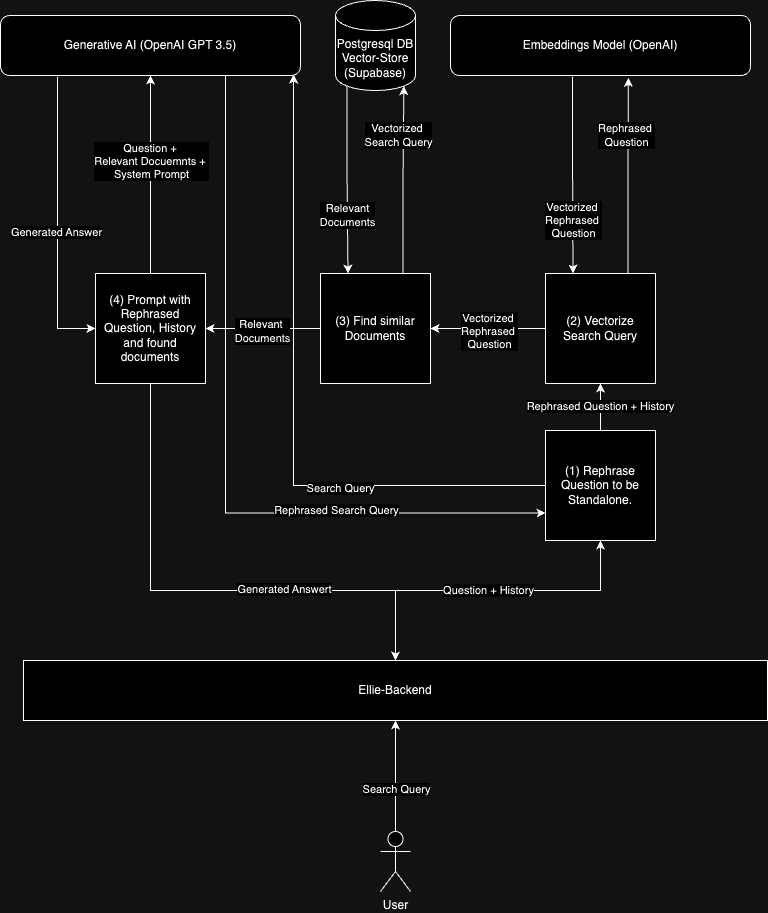

# Ellie: Open Source Dungeons & Dragons AI Chatbot


Ellie is an open-source AI chatbot developed using the Retrieval-Augmented Generation (RAG) architecture, tailored specifically for the Dungeons & Dragons universe through the usage of the content from the System Reference Document (SRD). This chatbot is designed to assist new players in familiarizing themselves with the intricate game mechanics of Dungeons & Dragons 5th Edition (5e).

**Getting Started**: To interact with Ellie, visit https://elminster-gpt.vercel.app/ and pose your questions. The chatbot leverages D&D SRD content to provide accurate responses, displaying the source paragraph from the SRD on the right side of the screen for reference.

## RAG Architecture

### Embedding step
An RAG approach is generally two stepped. First, the relevant Documents need to be vectorized, to make them available for the later retrieval step. This can be seen in the following diagram. 


As the diagram details, preparing input documents for retrieval augmented generation is done by:
1. splitting the Input into relevant chunks of a given size, 
2. generating the vectors through an embeddings model, and then 
3. saving those vectors to a vector store.

### Retrieval Step

The retrieval step allows us to embed context into an interaction with a LLM based Chatbot. The goal is to improve the Chatbots understanding of the domain on which the questions are based. In our example, we can ensure that the bot answers questions only based on the Dungeons and Dragons Rules. The retrieval step is detailed in the following example. 



1. Rephrase Question to be standalone:  This step is especially important if the user asks follow-up Questions. For details see Learning #1.
2. Vectorize Search Query: The rephrased question gets translated into a vector representation by the embeddings model.
3. Find Similar Documents: The vectorized rephrased Question is used to query the vector store with our input documents. A vector similarity search is done, and the closest 5 vectors and their textual representation are returned. These Documents are passed on to the next step as context.
4. The LLM (ChatGPT 3.5) takes the rephrased Question, the relevant Context and the Chat history and generates an answer based on this information.  

## Learnings

### Learning #1:

The embedding model's handling of conversational history presented a challenge. For example, the bot initially struggled with contextualizing follow-up questions, such as deducing that inquiries about spells were related to a previously mentioned wizard class.
The Solution: Integrating a feature where the AI restructures queries into stand-alone questions, informed by both the immediate question and the preceding conversation. This significantly improved the bot's contextual understanding, enhancing its responses with relevant information.

For example:
* Initial Question: "Which class can cast spells?"
* AI Response: "A Wizard can cast spells."
* Follow-up Question: "What spells are available?"
* Refined Query for AI: "What spells can a Wizard cast?"

### Learning #2:

For RAG (Retrieval-Augmented Generation) to work, a larger knowledge base needs to be split into smaller chunks. The chunks need to be sufficiently small so that around 5-10 can fit into one prompt without exceeding the context length of the LLM. Moreover, each chunk needs to be sufficiently large to contain relevant information. Experience shows a maximum chunk length of 1000 characters is reasonable. With this, the model can easily fit 5 chunks of information without exceeding the context length. In our case, the knowledge base is the Dungeons and Dragons SRD content in markdown format.

Langchain provides pre-made Text Splitters to chunk a larger knowledge base into smaller parts. Specifically, there is the `MarkdownHeaderTextSplitter` for Python and the `MarkdownTextSplitter` in JavaScript. Both splitters try to split the knowledge base around markdown headlines, so that one markdown chapter results in one or more chunks. The Python version even retains the position in the header hierarchy of each chunk; the JavaScript version of the splitter does not.

#### The Problem

Through experimentation with Elli, we encountered the challenge that text in very long chapters gets disassociated from the chapter headline when splitting. Take a look at the following example:

```markdown
Wizard Spells
-------------
### Level 1 Spells
 * <Spell List with many spells. Total number of tokens exceeding the configured limit>
### Level 2 Spells
 * <Another List of spells>
```

This example would be split into two documents:

##### First Chunk
```markdown
Wizard Spells
-------------
### Level 1 Spells
 * <Spell List with many spells. Total number of tokens exceeding the configured limit>
```

##### Second Chunk
```markdown
### Level 2 Spells
 * <Another List of spells>
```

The context information, `Wizard Spells`, got lost in the second document. It is unclear to which class the level 2 spells belong.

#### The Solutions

With **Contextual Chunk Headers**, we can split our knowledge base into chunks that have contextual information at the beginning of the chunk. We implemented a custom document splitter that retains the hierarchical position of a chunk in relation to the markdown headlines. Using this custom document splitter, we receive the following two chunks from our example:

##### First Chunk
```markdown
Wizard Spells
-------------
### Level 1 Spells
 * <Spell List with many spells. Total number of tokens exceeding the configured limit>
```

##### Second Chunk
```markdown
Wizard Spells
-------------
### Level 2 Spells
 * <Another List of spells>
```

The hierarchical context is preserved. While this splitting logic is supported by the Python version of Langchain, we had to implement our own solution for the JavaScript version. Details can be found in `/lib/vectorstore/HierarchicalMarkdownTextSplitter`.

### Learning #3:

For continuously improving a RAG pipeline, it is necessary to have the means to measure the acutal performance of one iteration against another one. Without this information improving a RAG pipeline becomes a guessing game; improvements in certain aspects might have adverse effects in others. 

#### The Problem

There are 2 requirements to measuring a RAG pipelines performance.

1. We need to have a ground truth sample set containing sample question and the ground truth answers to those question. 
2. We to have a mechanism to compare the performance of our RAG pipeline when answering the sample questions with the ground truth answers. 

#### The solution

ragas is a framework that allows for the automatic generation of a sample set and the automatic evaluation of a RAG pipeline on a set of sample questions. ragas generates questions and ground truth answers to that questions based on the knowledge base provided.

ragas also can evaluate a RAG pipeline performance on a sample set based on 4 metrics:

**Faithfulness**: How factually acurate is the generated answer.

**Answer Relevancy**: How relevant ist the generated answer to the question.

**Context Precision**: The signal to noise ratio of retrieved context.

**Context Recall**: Can it retrieve all relevant information required to answer the question.

When comparing the different splitting technique from Learning #2, the results from ragas indicated an improvement:

##### Default Langchain Markdown Splitter
| Context Precision | Faithfulness | Answer Relevancy | Context Recall |
|-------------------|--------------|-----------------|----------------|
| 0.8856            | 0.8379       | 0.9451          | 0.7946         |
| 0.8942            | 0.8507       | 0.9427          | 0.7726         |
| 0.9093            | 0.8576       | 0.9443          | 0.7953         |
| 0.8901            | 0.8451       | 0.9452          | 0.7881         |
| 0.8889            | 0.8569       | 0.9480          | 0.7953         |

##### With Contextual Chunk Headers
| Context Precision | Faithfulness | Answer Relevancy | Context Recall |
|-------------------|--------------|-----------------|----------------|
| 0.9383            | 0.9750       | 0.9098          | 0.9025         |
| 0.9373            | 0.9750       | 0.9094          | 0.8925         |
| 0.9433            | 0.9474       | 0.9082          | 0.9025         |
| 0.9401            | 0.9750       | 0.9120          | 0.9025         |
| 0.9481            | 0.9150       | 0.9068          | 0.8811         |


#### Drawbacks

* The generation of test questions is very expension. 20 Question/Ground Truth samples resulted in a cost of 5 Euro.
* The Evaluation step is non deterministic. Each run of the evaluation results in sightly different scores of those metrics. 


## References

* The foundation for this project is the [nextjs ai chatbot template](https://vercel.com/templates/next.js/nextjs-ai-chatbot), enabling rapid development and deployment.
* D&D SRD content utilized in this project is sourced from [BTMorton](https://github.com/BTMorton/dnd-5e-srd/tree/master/yaml), offering a comprehensive collection of D&D resources.

## Learning and Contributing

Are you keen on exploring RAG, Next.js, and Large Language Models (LLMs)? Join our community! Contributing to Ellie provided me with invaluable insights into these cutting-edge technologies. Whether you're looking to learn or contribute, your involvement is welcome. Dive into the world of AI-driven Dungeons & Dragons and enhance your understanding while contributing to an exciting project.
