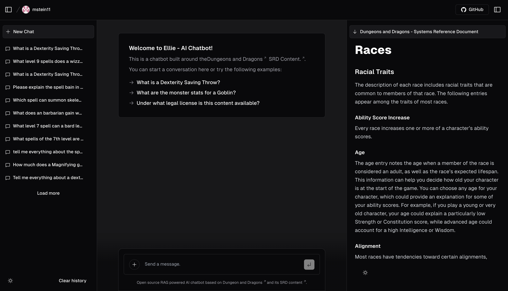

# Elminster-GPT

Open source RAG powered AI chatbot based on Dungeons and Dragons and its SRD Conetnt.

The purpose of this is to enable new players to more easily adapt to the game mechanics of Dungeon and Dragon 5e.

To use it, simply navigate to https://elminster-gpt.vercel.app/ and type away your question. The chatbot will generate an answer to your question based on the Dungeons and Dragons SRD content. Additionally, the paragraph on which the ai chatbot bases its answer will be displayed on the right side of the screen.

## RAG Architecture

TODO.

## References

This project is build upon the [nextjs ai chatbot template](https://vercel.com/templates/next.js/nextjs-ai-chatbot)
This project uses the DND SRD sources from [BTMorton](https://github.com/BTMorton/dnd-5e-srd/tree/master/yaml)

## Learning and Contributing

Interested in learning about RAG, nextjs and LLMs in general? Feel free to get in touch! Workin on this project was a great way for me to further my understanding of those technologies and concepts and I would gladly share my knowledge. I am still looking for contributors as well, if you want to get your hands dirty with those technologies.